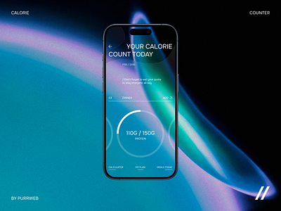
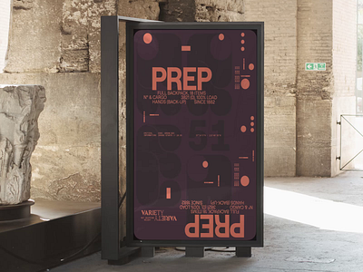
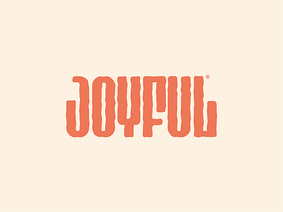
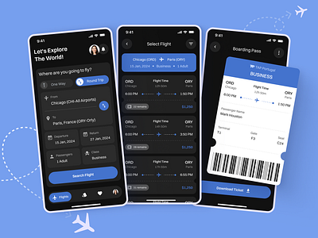
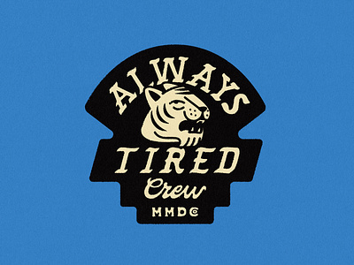
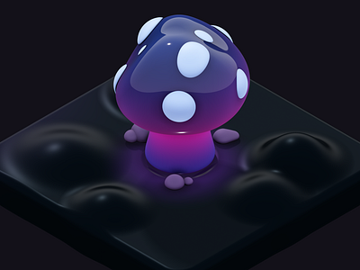
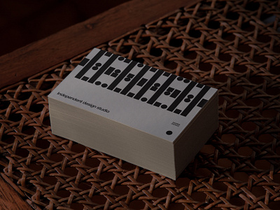
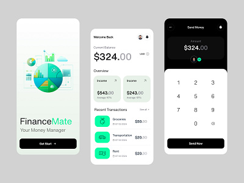
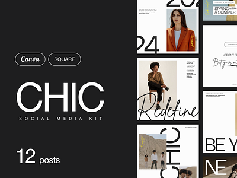

##index.html:
```
<!DOCTYPE html>
<html lang="en">
<head>
    <meta charset="UTF-8">
    <meta name="viewport" content="width=device-width, initial-scale=1.0">
    <title>Dribbble Clone</title>
    <link rel="stylesheet" href="styles.css">
</head>
<body>
    <header>
        <nav>
            <div class="logo">
                <a href="#">Dribbble</a>
            </div>
            <ul class="nav-links">
                <li><a href="#">Shots</a></li>
                <li><a href="#">Designers</a></li>
                <li><a href="#">Teams</a></li>
                <li><a href="#">Community</a></li>
                <li><a href="#">Jobs</a></li>
            </ul>
            <div class="auth-links">
                <a href="#">Sign up</a>
                <a href="#">Sign in</a>
            </div>
        </nav>
    </header>
    <main>
        <section class="hero">
            <h1>What are you working on? Dribbble is show and tell for designers.</h1>
            <button>Learn more</button>
            <button>Sign up</button>
        </section>
        <section class="shots">
            <div class="shot">
                
                <p>Famous</p>
            </div>
            <div class="shot">
                
                <p>Balkan Brothers</p>
            </div>
            <div class="shot">
                
                <p>Jan Losert</p>
            </div>
            <div class="shot">
                
                <p>Mattias Johansson</p>
            </div>
            <div class="shot">
                
                <p>Ruslan Siiz</p>
            </div>
            <div class="shot">
                
                <p>Paperpillar</p>
            </div>
            <div class="shot">
                
                <p>Alfrey Davilla | vaneltia</p>
            </div>
            <div class="shot">
                
                <p>A Studio-JQ Δ</p>
            </div>
            <div class="shot">
                
                <p>RomainTrystram</p>
            </div>
            <div class="shot">
                
                <p>inFullMobile</p>
            </div>
            <div class="shot">
                
                <p>FourPlus Studio</p>
            </div>
            <div class="shot">
                
                <p>MUTI</p>
            </div>
            <div class="shot">
                
                <p>floura</p>
            </div>
            <div class="shot">
                
                <p>Fauna</p>
            </div>
        </section>
    </main>
</body>
</html>
```

##styles.css:
```
body {
    font-family: Arial, sans-serif;
    margin: 0;
    padding: 0;
    background-color: #f5f5f5;
}

header {
    background-color: #333;
    padding: 10px 0;
}

nav {
    display: flex;
    justify-content: space-between;
    align-items: center;
    max-width: 1200px;
    margin: 0 auto;
    color: #fff;
}

.logo a {
    color: #fff;
    text-decoration: none;
    font-size: 1.5em;
}

.nav-links {
    list-style: none;
    display: flex;
}

.nav-links li {
    margin: 0 15px;
}

.nav-links a {
    color: #fff;
    text-decoration: none;
}

.auth-links a {
    margin: 0 10px;
    color: #fff;
    text-decoration: none;
}

.hero {
    text-align: center;
    padding: 50px 20px;
    background-color: #fff;
}

.hero h1 {
    margin: 0 0 20px;
}

.hero button {
    padding: 10px 20px;
    margin: 0 10px;
    border: none;
    background-color: #ea4c89;
    color: #fff;
    cursor: pointer;
}

.hero button:hover {
    background-color: #c93c70;
}

.shots {
    display: flex;
    flex-wrap: wrap;
    justify-content: center;
    padding: 20px;
}

.shot {
    background-color: #fff;
    border: 1px solid #ddd;
    margin: 10px;
    padding: 10px;
    width: 150px;
    text-align: center;
    box-shadow: 0 0 10px rgba(0, 0, 0, 0.1);
}

.shot img {
    max-width: 100%;
    height: auto;
}

.shot p {
    margin: 10px 0 0;
}
 
```

##Output:

